# Отчёт по ДЗ 3

## 1. Кластер и MLflow

**`kubectl get pods`**

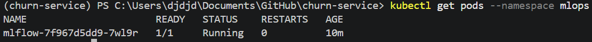

**`kubectl get ingress -A`**

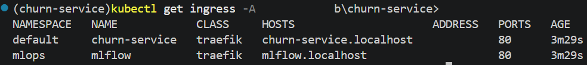

**Скриншот MLflow**

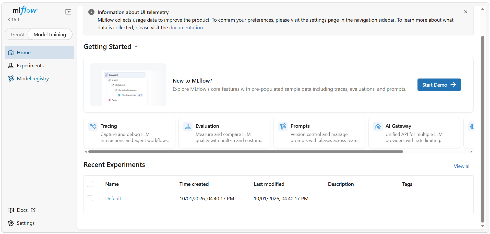

---

## 2. Model Registry и запуски

**Скриншот Model Registry**

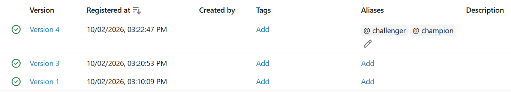

**Запуски**

| № | Скриншот |
|---|---|
| 1 | 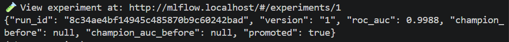 |
| 2 | 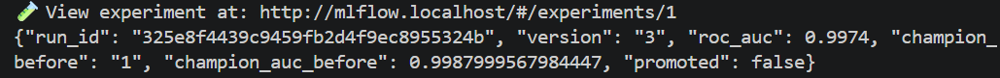 |
| 3 | 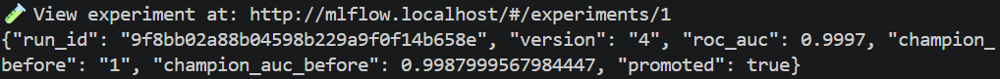 |

---

## 3. Смена версии модели: `/health` до и после

| | Скриншот |
|---|---|
| До | 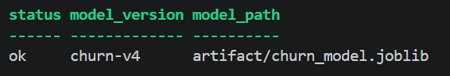 |
| После | 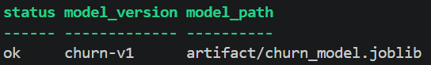 |

От клика в UI до ответа старой версии прошло около 18 секунд.

---

## 4. CI

- **Зелёный прогон:** https://github.com/IgorGayvoronskiy/churn-service/actions/runs/37107229047
- **Settings → Actions → Runners:**

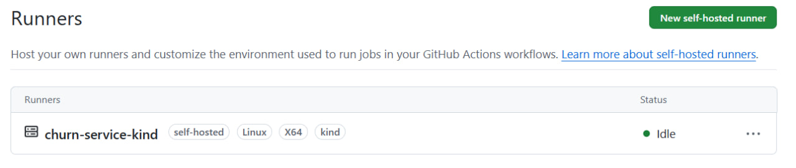

---

## 5. DVC

| Команда | Скриншот |
|---|---|
| `dvc push` | 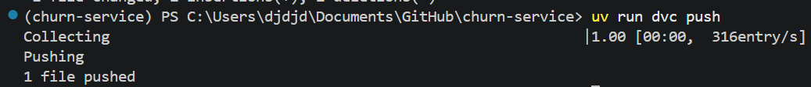 |
| `dvc diff` | 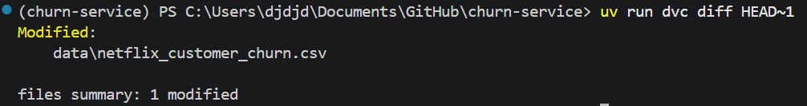 |
| `dvc pull` | 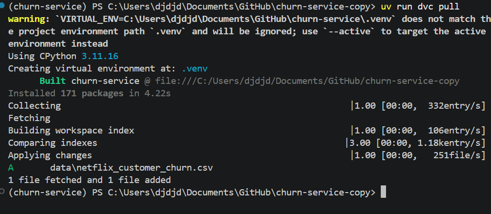 |

**Прогоны MLflow**

| № | Скриншот |
|---|---|
| 1 | 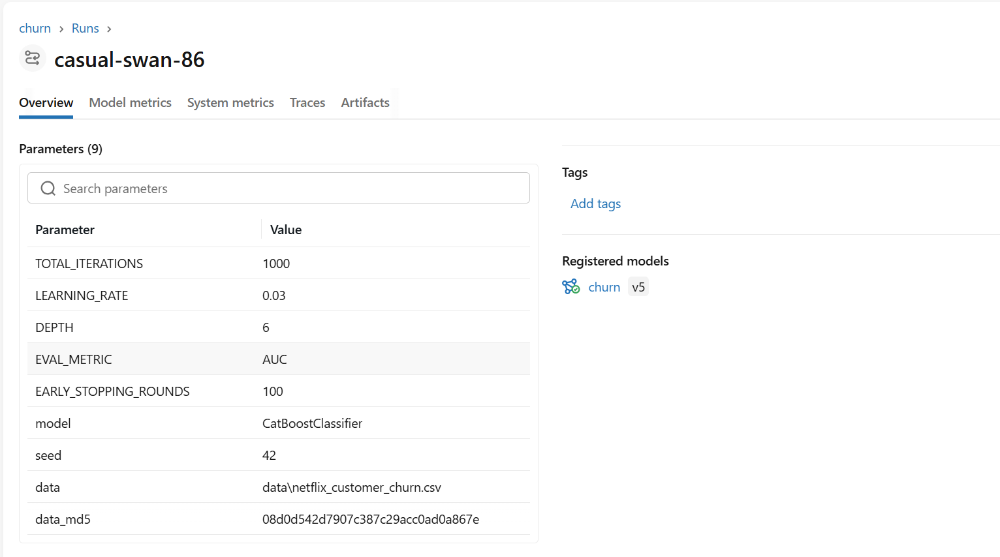 |
| 2 | 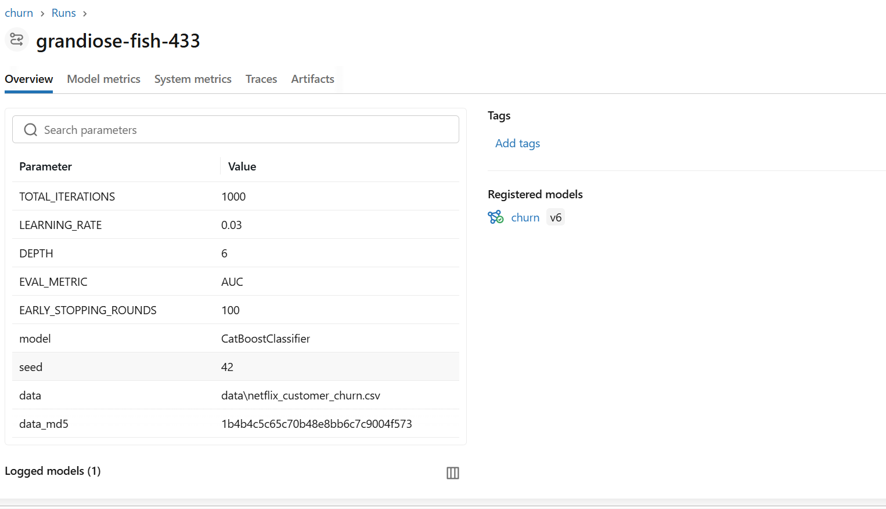 |

---

## 6. HPA и нагрузочный тест

**k9s**

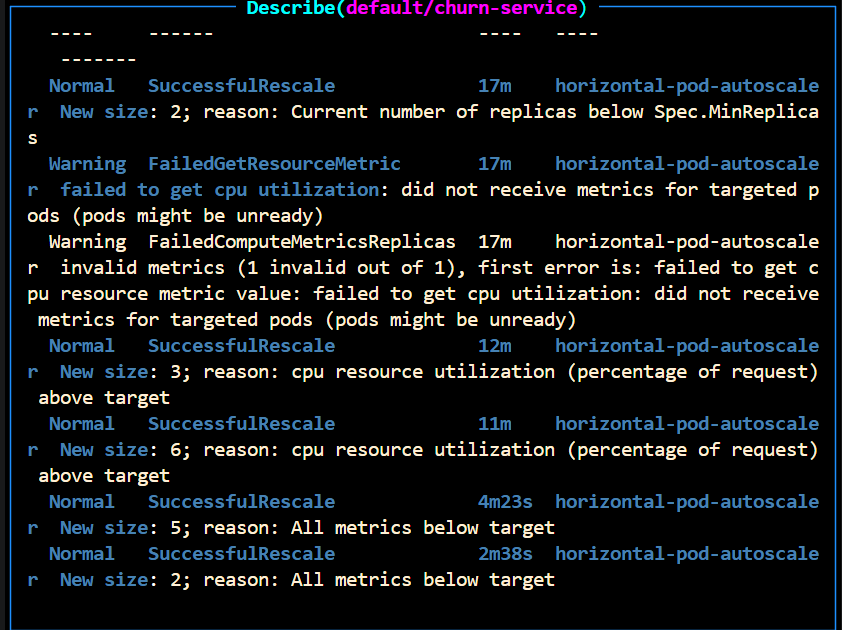

**События из `kubectl describe hpa`**

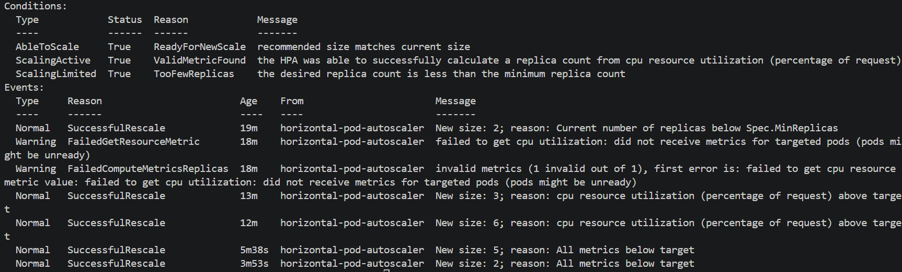

**Результаты**

| Пользователи | Реплики (старт → пик) | p95, мс (все запросы / `/v1/predict`) | CPU на под (пик → после балансировки) | RPS | Ошибки |
|---|---|---|---|---|---|
| 20 | 2 → 4 | 11 / 12 | 93% → ~20% | ~10 | 0 |
| 40 | 2 → 3 | 11 / 11 | 78% → ~50% | ~19,8 | 0 |
| 60 | 2 → 6 | 72 / 73 | 224% → ~47% | ~29,5 | 1 (502 Bad Gateway, 0,01%) |

**requests**

| До | После |
|---|---|
| 256Mi | 220Mi |

---

## 7. Намеренно сломанные прогоны CI

### 7.1. Неверный алиас модели

- **Шаг, на котором упало:** «Сервис»
- **Ошибка:** `mlflow.exceptions.RestException: INVALID_PARAMETER_VALUE: Registered model alias wrong_alias not found`
- **Пояснение:** причина ошибки видна непосредственно из текста диагностики.
- **Красный прогон:** https://github.com/IgorGayvoronskiy/churn-service/actions/runs/37120146450
- **Зелёный прогон:** https://github.com/IgorGayvoronskiy/churn-service/actions/runs/37120956487

### 7.2. Неверное имя kind-кластера

- **Шаг, на котором упало:** «kind, kubectl и доступ к кластеру»
- **Ошибка:** `ERROR: could not locate any control plane nodes for cluster named 'churn-service-wrong'. Use the --name option to select a different cluster.`
- **Пояснение:** из текста видно, что команда не нашла control plane ноду кластера `churn-service-wrong`.
- **Красный прогон:** https://github.com/IgorGayvoronskiy/churn-service/actions/runs/37121455530
- **Зелёный прогон:** https://github.com/IgorGayvoronskiy/churn-service/actions/runs/37121997679

### 7.3. Недоступность сервиса через Ingress

- **Шаг, на котором упало:** «smoke»
- **Что видно в логах:** приложение успешно запустилось, readiness/liveness-запросы возвращают 200 OK, ошибок приложения нет, но запросов smoke-теста в логах нет.
- **Пояснение:** скорее всего, ошибка произошла при подключении к сервису через Ingress, поэтому запрос `/health` из smoke-теста не успел выполниться.
- **Красный прогон:** https://github.com/IgorGayvoronskiy/churn-service/actions/runs/37122698196
- **Зелёный прогон:** https://github.com/IgorGayvoronskiy/churn-service/actions/runs/37123358984

---

## 8. Вопросы

### 8.1.

У `tests` и `build` в поле `runs-on` указан `ubuntu-latest`, поэтому GitHub сам выделяет для них виртуальную машину. Для `deploy` runner запускается на собственной машине через `[self-hosted, kind]`.

Альтернативы:
- соединить GitHub-hosted runner с кластером через VPN;
- использовать публичный Kubernetes API-сервер;
- использовать промежуточный сервер.

Self-hosted runner выбран как наиболее простой и естественный вариант.

### 8.2.

`--network kind` позволяет подключить runner к Docker-сети kind, без Docker сокета runner не сможет управлять Docker daemon хоста, а `--group-add 0` даёт необходимые права на доступ к этому сокету - без них соответственно пропадёт сетевой доступ к кластеру, управление Docker и доступ к Docker socket

### 8.3.

Такая запись делает создание секрета идемпотентным: при повторном деплое существующий Secret обновится. Обычный `kubectl create secret` при втором запуске завершится ошибкой `AlreadyExists`.

### 8.4.

Алиас `challenger` указывает, что модель является кандидатом, а `champion` — что модель показала лучшую целевую метрику. Сервис запрашивает модель по алиасу, потому что по номеру версии непонятно, какая модель подойдёт лучше.

Откат модели через алиас требует лишь перезапуска подов, а изменение кода меняет конфигурацию подов и требует их пересоздания.

### 8.5.

Сервис не найдёт модель с алиасом `champion`, и под упадёт со статусом `CrashLoopBackOff`. В логах CI будет видна ошибка:

```
mlflow.exceptions.RestException: INVALID_PARAMETER_VALUE: Registered model alias champion not found
```

### 8.6.

Запрос проходит путь:

```
браузер → порт 80 хоста → порт 80 kind-control-plane → traefik NodePort 30080 → сервис mlflow:5000 → под mlflow:5000
```

- `--allowed-hosts` задаёт значения хостов, по которым можно обращаться к MLflow.
- `--cors-allowed-origins` определяет, с каких адресов разрешено подключаться к MLflow.
- Порт 80 задаётся при создании кластера, потому что `extraPortMappings` настраивает проброс порта хоста в контейнер kind-control-plane ноды. После этого Kubernetes этим внешним Docker-пробросом уже не управляет.

### 8.7.

Согласно формуле HPA должен был выставить около 7 реплик, но из-за ограничения в 6 реплик больше выставить не смог. При спаде нагрузки HPA ждёт некоторое время, чтобы убедиться, что нагрузка не вырастет снова и не придётся заново поднимать количество реплик.

### 8.8.

В git лежат метафайлы DVC, а в хранилище DVC — файлы с данными. Чтобы восстановить данные, на которых обучена версия N модели, нужно взять из логов этой модели параметр `md5_hash` и название файла с данными, а затем по этому хэшу откатить нужный файл к нужной версии.

---

## Звёздочка1:
- **Прогон без деплоя:** https://github.com/IgorGayvoronskiy/churn-service/actions/runs/37123230280
- **Прогон по кнопке:** https://github.com/IgorGayvoronskiy/churn-service/actions/runs/37123358984
---

## Журнал ошибок

### 1. `skops_trusted_types` в `log_model`

**Лог ошибки:**

```
File "C:\Users\djdjd\Documents\GitHub\churn-service\.venv\Lib\site-packages\mlflow\catboost\__init__.py", line 146, in save_model
    cb_model.save_model(model_data_path, **kwargs)
TypeError: CatBoost.save_model() got an unexpected keyword argument 'skops_trusted_types'
```

**Когда возникла:** при обучении модели.

**Починка:** убрал параметр `skops_trusted_types`.

### 2. `bool` не сериализуется в JSON

**Лог ошибки:**

```
Traceback (most recent call last):
  File "<frozen runpy>", line 198, in _run_module_as_main
  File "<frozen runpy>", line 88, in _run_code
  File "C:\Users\djdjd\Documents\GitHub\churn-service\src\churn\train.py", line 220, in <module>
    main()
  File "C:\Users\djdjd\Documents\GitHub\churn-service\src\churn\train.py", line 212, in main
    print(json.dumps(result, ensure_ascii=False))
          ^^^^^^^^^^^^^^^^^^^^^^^^^^^^^^^^^^^^^^
  File "C:\Users\djdjd\AppData\Roaming\uv\python\cpython-3.11-windows-x86_64-none\Lib\json\__init__.py", line 238, in dumps
    **kw).encode(obj)
          ^^^^^^^^^^^
  File "C:\Users\djdjd\AppData\Roaming\uv\python\cpython-3.11-windows-x86_64-none\Lib\json\encoder.py", line 200, in encode
    chunks = self.iterencode(o, _one_shot=True)
             ^^^^^^^^^^^^^^^^^^^^^^^^^^^^^^^^^^
  File "C:\Users\djdjd\AppData\Roaming\uv\python\cpython-3.11-windows-x86_64-none\Lib\json\encoder.py", line 258, in iterencode
    return _iterencode(o, 0)
           ^^^^^^^^^^^^^^^^^
  File "C:\Users\djdjd\AppData\Roaming\uv\python\cpython-3.11-windows-x86_64-none\Lib\json\encoder.py", line 180, in default
    raise TypeError(f'Object of type {o.__class__.__name__} '
TypeError: Object of type bool is not JSON serializable
```

**Починка:** добавил `float(...)` для new_auc и `bool(...)` для promoted.

### 3. Ошибка smoke-теста при выкатке

**Что происходило:** иногда при выполнении smoke-теста в `deploy` возникала ошибка из-за запроса, отправленного до того, как поды успели подняться.

**Починка:** перезапускал упавшие джобы через *Re-run all failed jobs*.